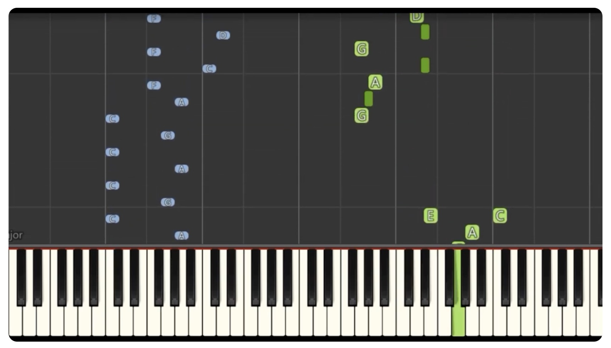

# xwan0876_Major_Project

## 1 Interaction Instructions
After loading the page, the square generated at the intersection of the horizontal and vertical lines will change color randomly. When the mouse clicks the play button, the mouse movement can control the volume and channel, and control the size of the square.

## 2 Details of the approach
### 2.1 Code
I use audio and mouse interaction to drive my code.
### 2.2 Animation
I animated the square at the intersection of the horizontal and vertical lines because I think the intersection should be highlighted. My team members made changes to the lines and rectangles, so I chose the square. And their animation is based on color, quantity and movement, so I changed the size of the square.
### 2.3 Inspiration
Since the background of this work depicts American streets and jazz, I specially selected a piano accompaniment with boogie woogie. I saw a video on YouTube of playing boogie woogie on the piano on an app, and the scales were particularly rhythmic as the melody fell. 
[click this link to view the videdo](https://www.youtube.com/watch?v=NNe86B56__o)

This also reminded me of the scene in the early 21st century when TVs often flashed because of no signal.

Therefore, after entering the page, you can see that the square at the intersection is flashing and changing. Secondly, after loading the music, the volume of the music can control the size of the square.
### 2.4 Technical explanation
####  Changes to the group code
- Delete noLoop:
  In the group code, we use noLoop to ensure "draw function" only runs once, but it limits my animate effect on my individual code, so I delete it.
- Introduce class for the whole painting:
  We did'nt use "class" in group code. In order to simplify the code, I created the class "MondrainArt" to seal the relevant attributes for subsequent calls and maintenance.
- Separate “calculate” and “draw” function: After deleting noLoop, the canvas will refresh all the time, hindering the subsequent animation. I admit that I used ChatGPT to solve this problem, and it provided me with the idea of ​​logical separation. The calculation part is responsible for data processing and logical operations, and the generation part is responsible for graphics rendering and display. Separating the two can avoid mixing complex logic in one function and reduce the possibility of errors.
####  Technic outside the course
- The floor() function is used to round a number down to the nearest integer.
  [click this link to view the "floor" resource](https://p5js.org/zh-Hans/reference/#/p5/floor)